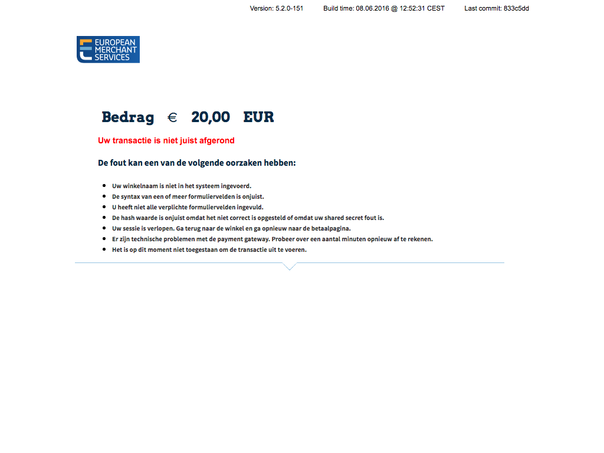

# WordPress Pay Gateway: EMS e-Commerce

**EMS e-Commerce Gateway driver for the WordPress payment processing library.**

[](https://travis-ci.org/wp-pay-gateways/ems-e-commerce)
[](https://coveralls.io/github/wp-pay-gateways/ems-e-commerce?branch=master)
[](https://packagist.org/packages/wp-pay-gateways/ems-e-commerce)
[](https://packagist.org/packages/wp-pay-gateways/ems-e-commerce)
[](https://packagist.org/packages/wp-pay-gateways/ems-e-commerce)
[](https://packagist.org/packages/wp-pay-gateways/ems-e-commerce)
[](http://gruntjs.com/)


## Links

*	[European Merchant Services](https://emscard.nl)
	*	[Handleidingen](https://emscard.nl/support/categorie/handleidingen)
	*	[Hoe installeer ik mijn EMS e-Commerce Gateway met de Sellxed Plug-in?](https://emscard.nl/support/hoe-neem-ik-mijn-ems-e-commerce-gateway-met-sellxed-plug-gebruik)


## Documentation

| Title                                                                                            | Language | Date    |
| ------------------------------------------------------------------------------------------------ | -------- | ------- |
| [EMS e-Commerce - Gateway Hosted Payment Page - Technical Integration Manual][doc-hpp-jul-2016]  | EN       | 2016-07 |
| [Card Acceptance Operating Guide For Card Not Present (CNP) Merchants][doc-cnp]                  | EN       | 2016-07 |
| [EMS e-Commerce Gateway API - Technical Installation Manual][doc-api-feb-2016]                   | EN       | 2016-02 |
| ~~[EMS e-Commerce Gateway HPP - Technical Installation Manual][doc-hpp-feb-2016]~~               | EN       | 2016-02 |
| [Handleiding EMS e-Commerce Gateway][doc-han-feb-2016]                                           | NL       | 2016-02 |

[doc-hpp-jul-2016]: https://www.pronamic.eu/wp-content/uploads/sites/2/2016/07/EMS-Integration-Manual-e-Commerce-Gateway-HPP-NL-EN-2016-7.pdf
[doc-cnp]:          https://www.pronamic.eu/wp-content/uploads/sites/2/2016/07/EMS-CNP-Card-Acceptance-Operating-Guide-NL-EN-2016-6.pdf
[doc-api-feb-2016]: https://www.pronamic.eu/wp-content/uploads/sites/2/2016/06/EMS-e-Commerce-Gateway-Manual-API-installation-2016-2-NL-EN.pdf
[doc-hpp-feb-2016]: https://www.pronamic.eu/wp-content/uploads/sites/2/2016/06/EMS-e-Commerce-Gateway-Manual-HPP-installation-2016-2-NL-EN.pdf
[doc-han-feb-2016]: https://www.pronamic.eu/wp-content/uploads/sites/2/2016/06/Gebruikershandleiding-EMS-e-Commerce-Gateway-2016-3-NL-NL_0.pdf

### Changes February 2016 and July 2016

*	Revised chapters 1 and 2 in relation to new ‘combinedpage’ checkout option, pages 3-5
*	Revised message examples, pages 5-6
*	Comment on mode parameter in relation to checkout options, page 8
*	Parameter checkoutoption, page 9
*	merchantTransactionId for postAuth, page 11
*	ponumber, page 11/12
*	email field limitation correction, page 14
*	fullbypass correction, page 15
*	Examples for transaction status, page 20
*	Reworked explanation for hash generation, page 23 


## Notes

*	The documentation states that `timezone` needs to be in the `Area/Location` format, but invalid timezone values will not result in errors.
*	The documentation states that `language` parameter is limited to a few specific langauges, but unsupported or invalid langauge values will not result in errors.


## FAQ

### How to solve "Purchase amount exceeds merchant limit." errors?

If you do a payment and getting back the "Purchase amount exceeds merchant limit." fail reason you have to check the "Fraud Settings » Set Maximum Purchase Amount" value.
By default this setting may be set to `€ 0,00` you have to increase to the maximum amount you allow clients to pay in once.

```
N:-5005:FRAUD – Purchase limit exceeded
Purchase amount exceeds merchant limit.
```


## Screenshots

### Uw transactie is niet juist afgerond



**De fout kan een van de volgende oorzaken hebben:**

*	Uw winkelnaam is niet in het systeem ingevoerd.
*	De syntax van een of meer formuliervelden is onjuist.
*	U heeft niet alle verplichte formuliervelden ingevuld.
*	De hash waarde is onjuist omdat het niet correct is opgesteld of omdat uw shared secret fout is.
*	Uw sessie is verlopen. Ga terug naar de winkel en ga opnieuw naar de betaalpagina.
*	Er zijn technische problemen met de payment gateway. Probeer over een aantal minuten opnieuw af te rekenen.
*	Het is op dit moment niet toegestaan om de transactie uit te voeren.
